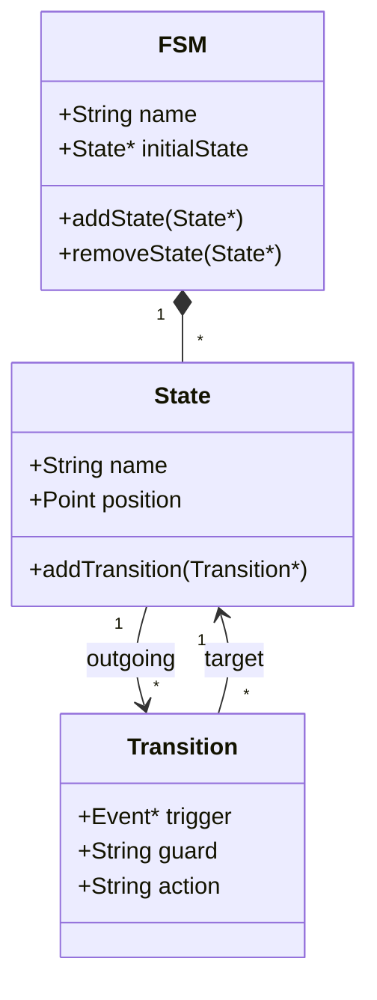

# Model Module

The **Model** module contains the core data structures that represent a Finite State Machine (FSM). Ideally, this module is pure C++ and has zero dependencies on Qt (though currently it may usage QString/QList for convenience, which is acceptable in a Qt project, but logic is decoupled from Widgets).

## Key Classes

### [FSM](FSM.h)
The root aggregation class representing the entire State Machine.
- Holds a list of `State` objects.
- Defines the `initialState`.
- Manages the lifecycle of its components.

### [State](State.h)
Represents a node in the FSM graph.
- Has a unique name.
- Contains entry and exit actions.
- Maintains a list of outgoing `Transition`s.
- Can be marked as `initial` or `final`.

### [Transition](Transition.h)
Represents a directed edge between two `State`s.
- Connects a **Source** state to a **Target** state.
- Triggered by an `Event`.
- Can have a **Guard Condition** (boolean check).
- Can have an **Action** (executed during transition).

### [Event](Event.h)
Represents a signal or trigger that causes state transitions.

## Relationship Diagram

