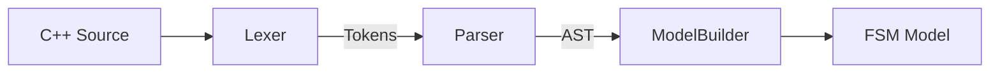

# QtFSM Parsing System Developer Guide

This document provides a technical overview of the **Reverse Engineering** engine in QtFSM. It explains how C++ code is analyzed and converted into a visual State Machine model.

## 🏗️ Architecture Overview

The parsing pipeline follows a standard compiler frontend architecture:



### Key Components

| Component | Class | Responsibility |
|-----------|-------|----------------|
| **Lexer** | `Lexer` | Breaks raw text into meaningful symbols (Tokens). |
| **Parser** | `CppParser` | Analyzes tokens to build a structural representation (AST). |
| **AST** | `ClassDecl`, `FunctionDecl`, etc. | Abstract Syntax Tree representing C++ structures. |
| **Builder** | `ModelBuilder` | Traverses the AST and populates the `FSM` / `State` model. |

---

## 1. The Lexer (`Lexer.h/cpp`)
The Lexer takes a `QString` of code and produces a `QVector<Token>`.

- **Token Structure**: contains `type` (Identifier, Keyword, Symbol), `value` (string content), and `line` number.
- **Handling**: 
  - Skips whitespace and comments.
  - Identifies keywords (e.g., `class`, `void`, `return`).
  - Handles string literals and symbols (`{`, `}`, `;`).
  - **Limitations**: It is not a full C++ preprocessor; macros are largely ignored or treated as simple identifiers.

## 2. The AST (`AST.h`)
The Abstract Syntax Tree is a simplified representation of the C++ code, focused on the elements relevant to State Machines (Classes, Methods, Logic).

### Core Nodes
- **`ClassDecl`**: Represents a `class`. Contains name, base class, and list of member functions/variables.
- **`FunctionDecl`**: Represents a method. Contains return type, name, **parameters**, and a body (block of statements).
- **`Statement`**: Base class for code logic.
  - `IfStatement`: Capture transitions (`if (evt == "X")`).
  - `ReturnStatement`: Capture target states (`return new StateX()`).
  - `Block`: Represents `{ ... }` scopes.

## 3. The Parser (`CppParser.h/cpp`)
A **Recursive Descent Parser** that turns Tokens into an AST.

### Key Methods
- `parse()`: Entry point. Expects a sequence of Class declarations.
- `parseClass()`: Parses `class Name : Base { ... }`.
  - **Filtering**: Only parses classes that look like States (inherit `MyFSMStateBase` or end in `State` etc.).
- `parseFunction()`: Parses method signatures and bodies.
  - **Parameter Parsing**: heuristics to identify types and names (`int x`, `Event& e`).
- `parseStatement()`: Recursively processes logic. Knows how to handle `if`, `return`, and blocks.

### Error Handling
- Uses `peek()`, `check()`, and `consume()` helpers to navigate the token stream.
- Resilient to some syntax errors but expects reasonably valid C++ structure.

## 4. The Model Builder (`ModelBuilder.h/cpp`)
The semantic bridge between the raw AST and the QtFSM Application Model.

- **Visitor Pattern**: Implements `ASTVisitor` to traverse the tree.
- **State Extraction**: 
  - Each `visisted` `ClassDecl` becomes a `State` object.
  - `onEntry` / `onExit` methods in AST become `State::entryAction` / `exitAction`.
  - Other methods become **Custom Functions** in the State.
- **Transition Extraction**:
  - Analyzes the `handle()` function.
  - Looks for `IfStatement` checking an event type.
  - Looks for `ReturnStatement` returning a new State.
  - **Lazy Creation**: If a target state referenced in a return statement hasn't been parsed yet, `ModelBuilder` lazily creates it to ensure connectivity.

## 🔍 Debugging & Verification

The parsing system is heavily tested in `test_debug_parser.cpp` and `test_stress.cpp`.

### How to reproduce/test
Create a test case that feeds raw string code to the parser:

```cpp
QString code = "class MyState : public State { ... }";
CodeParser parser;
FSM* fsm = parser.parse(code);
// Assert that fsm->states() contains "MyState"
```

### Common Gotchas
- **Forward Declarations**: The parser currently ignores them; relies on Lazy Creation for unknown types.
- **Macros**: Heavily macro-ized code might confuse the simple Lexer.
- **Implicit Transitions**: Transitions must follow the pattern `if (event == "X") return new Y();` to be recognized.

---
**Next Steps for Developers:**
- To support *Validation*, look at creating a `Validator` class that runs on the `FSM` model after `ModelBuilder` completes.
