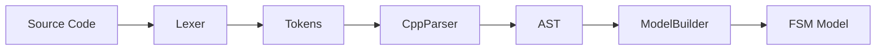

# Parsing Module

The **Parsing** module is responsible for reading existing C++ source code and reconstructing the FSM model from it (Reverse Engineering). It implements a hand-written parser specific to the C++ State Pattern logic used by this application.

## Key Classes

### [CodeParser](CodeParser.h)
The abstract base interface for parsing.

### [CppParser](CppParser.h)
The main driver class that orchestrates the parsing process. It uses the `Lexer` to get tokens and the `ModelBuilder` to construct the FSM.

### [Lexer](Lexer.h)
Performs lexical analysis on the raw C++ source string, converting it into a stream of `Token`s. It handles C++ keywords, identifiers, operators, and symbols.

### [Token](Token.h)
Represents a single unit of lexical meaning (e.g., `CLASS`, `IDENTIFIER`, `LBRACE`).

### [AST](AST.h)
Classes representing the Abstract Syntax Tree nodes (e.g., `ClassNode`, `FunctionNode`, `StateNode`).
- **TranslationUnit**: The root node.
- **ClassDecl**: Represents a class declaration.
- **FunctionDecl**: Represents a function.

### [ModelBuilder](ModelBuilder.h)
Visits the AST or processes parsed data to instantiate `State` and `Transition` objects in the `FSM` model.

## Parsing Flow

