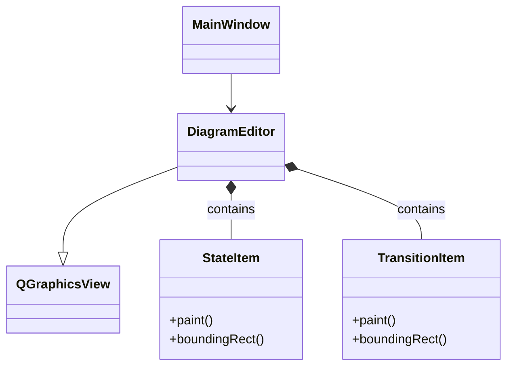

# View Module

The **View** module contains all the user interface components of the application. It is built using the Qt Widgets module and the Graphics View Framework. It follows the Passive View pattern where possible, delegating logic to the ViewModel.

## Key Components

### Main Windows & Panels
- **[MainWindow](MainWindow.h)**: The primary application window. Manages menus, toolbars, and the central layout.
- **[DiagramEditor](DiagramEditor.h)**: The central canvas where the FSM is drawn. It hosts the `QGraphicsScene`.
- **[PropertiesPanel](PropertiesPanel.h)**: A dock widget that displays and edits properties of the selected object (State or Transition).
- **[CodePreviewPanel](CodePreviewPanel.h)**: A dock widget showing the live-generated C++ code.

### Graphics Items
These classes inherit from `QGraphicsItem` and represent the visual elements on the canvas.
- **[StateItem](StateItem.h)**: Visual representation of a State (circle/ellipse with text). Handles mouse interactions for moving and selecting.
- **[TransitionItem](TransitionItem.h)**: Visual representation of a Transition (arrow between states). Calculates strict/curved paths and arrowheads.

### Dialogs
- **[AboutDialog](AboutDialog.h)**: Shows application information.
- **[StateDialog](StateDialog.h)**: (Legacy/Alternative) Modal dialog to add/edit states.
- **[TransitionDialog](TransitionDialog.h)**: (Legacy/Alternative) Modal dialog to add/edit transitions.

## Interaction Flow
1. User interacts with **MainWindow** (e.g., clicks "Add State").
2. **MainWindow** delegates command to **MainViewModel**.
3. **MainViewModel** provides data or signals update.
4. **DiagramEditor** observes the Model/ViewModel and updates the `QGraphicsScene`.
5. **StateItem** and **TransitionItem** are created/updated to match the Model.

## Class Diagram

