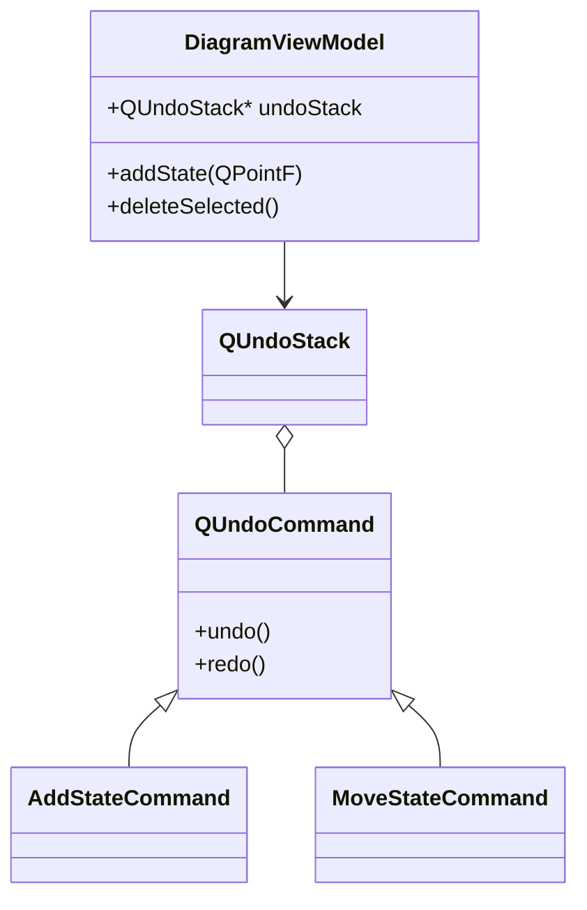

# ViewModel Module

The **ViewModel** module serves as the intermediary between the **Model** and the **View**, implementing the logic for user interactions and preserving the separation of concerns (MVVM pattern). It also hosts the **Command** pattern implementation for Undo/Redo functionality.

## Key Classes

### [DiagramViewModel](DiagramViewModel.h)
The primary ViewModel for the FSM diagram.
- Exposes `State` and `Transition` data to the view.
- Handles logic for adding/removing items.
- Manages the `QUndoStack`.
- Selection handling (keeping track of selected states/transitions).

### [ProjectViewModel](ProjectViewModel.h)
Manages project-level settings and metadata (if applicable, currently lightweight).

## Commands (Undo/Redo)

Located in `commands/`, these classes implement `QUndoCommand` to provide reversable actions.

- **[AddStateCommand](commands/AddStateCommand.h)**: Adds a state.
- **[DeleteStateCommand](commands/DeleteStateCommand.h)**: Removes a state (and its connections).
- **[AddTransitionCommand](commands/AddTransitionCommand.h)**: Adds a transition.
- **[DeleteTransitionCommand](commands/DeleteTransitionCommand.h)**: Removes a transition.
- **[MoveStateCommand](commands/MoveStateCommand.h)**: Captures state movement (dragging).

## Architecture

The ViewModel observes the `FSM` (Model) signals to know when to notify the View.
However, in this implementation, the View often uses the ViewModel to *perform* actions, which then update the Model.

